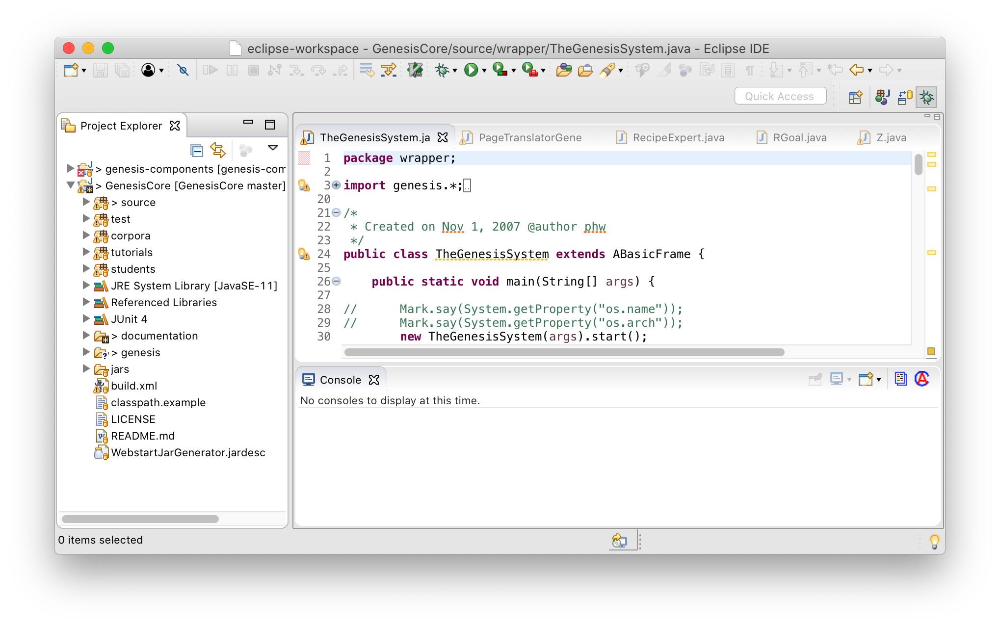
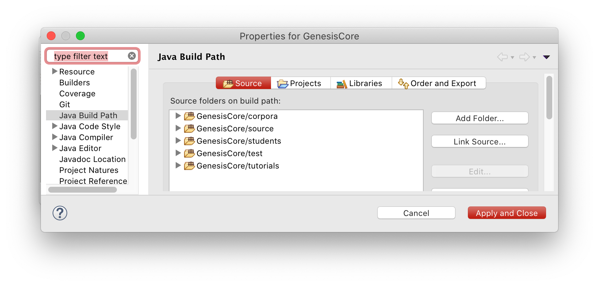
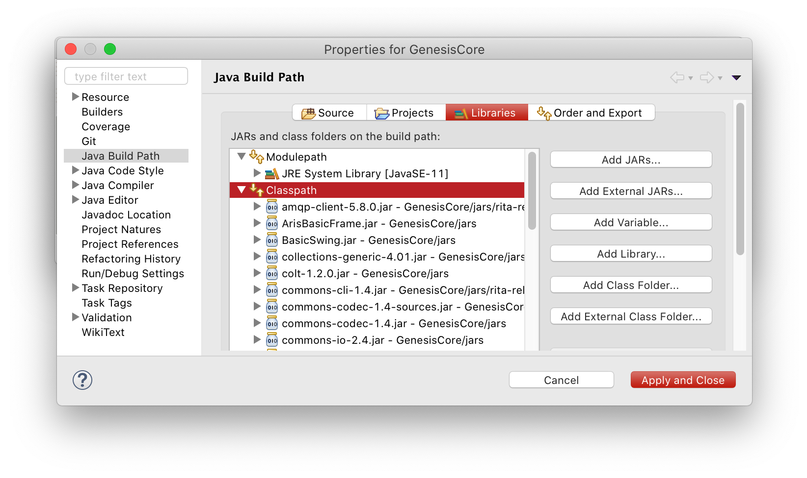
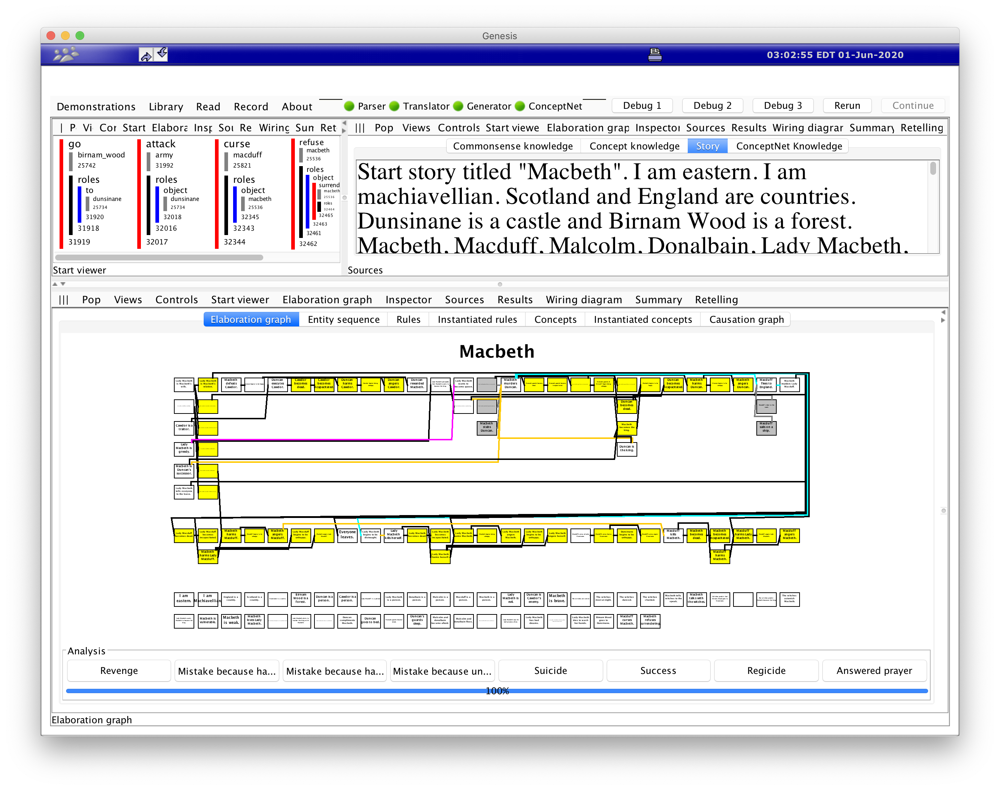
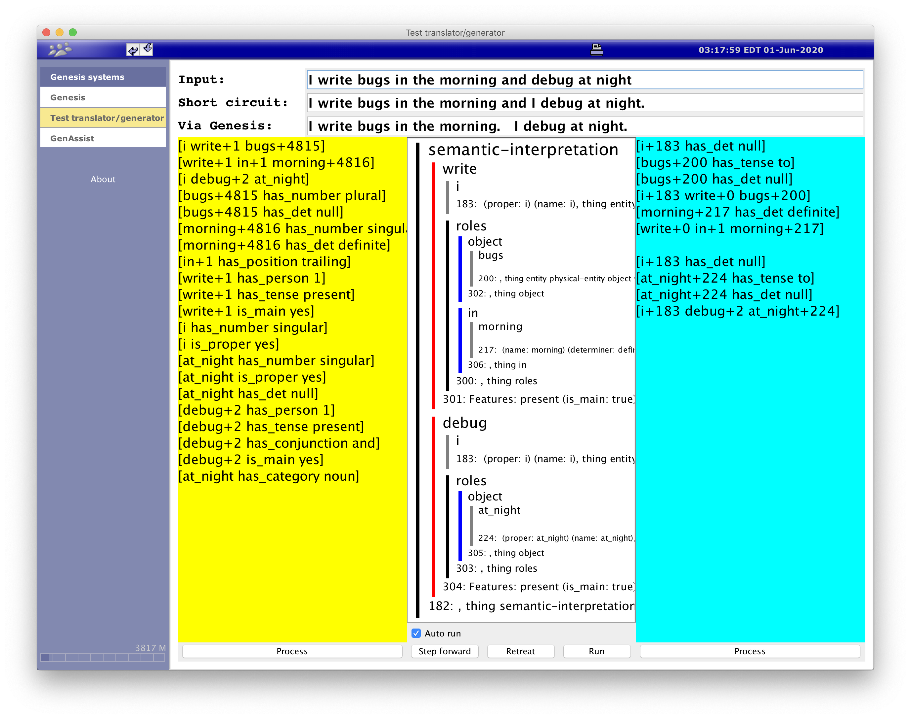
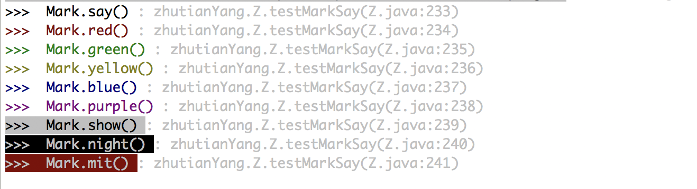

# Install GenesisCore Repository

After a decade of development, the original Genesis system is 8 GB in size and includes all student systems that are not essential for your application. So we created a lean version of Genesis, called GenesisCore. It is currently hosted on GitHub and this documentation is conveniently part of the repository.

## Step 1: Clone the repository

To clone the GenesisCore repository, you need to send [Yang](mailto:ztyang@mit.edu) your GitHub account name to be invited as a collaborator.

Open terminal and go to your favorite work directory (e.g., ~/Documents) to clone the project:

```
git clone git@github.com:zt-yang/GenesisCore.git
```

From now on, all your evil changes will be recorded. Yang once received the following email from Professor Patrick Winston after she screwed up the repository:

> When you get back to Cambridge the Genesis group will parade you around MIT wearing a placard around your neck that says "I did not check test cases."  You will be dressed in rags and wearing a dunce cap.  There will be crowds of students, all shouting insults and throwing garbage at you, especially in building 10 under the great dome.  There will be photographers.
>
> That all was a joke.
>
> You can keep all changes that do not break the test cases.  If it is a change to the look of the user interface, I want opportunity to approve.

We will get to the part about test cases later. It's hard to break the codes of others if you keep developing in your own student folder. If you make other minor changes in the source folder, please add a comment above the changes with your name, date of change, and purpose. After the student-developed functions/subsystems have stablized, they may be integrated into the source folder and shared with the Genesis group.

## Step 2: Set up the repository in Eclipse

### 1. Install Eclipse

First, you need to install [Eclipse IDE](https://www.eclipse.org/downloads/packages/installer), which makes debugging more efficient.

Add GenesisCore to Eclipse editor by going to "File" -> "Open File ..." -> Choose the location where you cloned GenesisCore. You are likely to see "Project Explorer" panel on the left side of Eclipse and GenesisCore should appear there.




### 2. Install Java 8

Install the most recent [Java SE Development Kit 8u251](https://www.oracle.com/java/technologies/javase/javase-jdk8-downloads.html).

To check you have the correct version, type `java -version` in commend line and you may see something like the following (in MacOS):

```
➜ java -version
openjdk version "1.8.0_222"
OpenJDK Runtime Environment (AdoptOpenJDK)(build 1.8.0_222-b10)
OpenJDK 64-Bit Server VM (AdoptOpenJDK)(build 25.222-b10, mixed mode)
```

To set JAVA_HOME in Windows OS, press Windows key and search for "Environmental Variables" -> "New" -> Choose the folder where you installed Java 8, e.g., `C:\\Program Files\Java\jdk1.8.0_251`

Check your Eclipse is using Java 8 by going to "Preferences" -> "Java" -> "Installed JREs". On the right, you may see something like the following,

Name  |  Location |  Type
--|---|--
Java 1.8 |  /Library/Java/JavaVirtualMachines/jdk1.8.0_202.jdk/Contents/Home/jre |  Standard

>

If you couldn't, try to "Add..." -> "Standard VM" -> Choose the location where you installed the JDK and find the JRE folder.


<!---
### 2. Install Java 11

Install [Java SE 11](https://www.oracle.com/java/technologies/javase-downloads.html).

To check you have the correct version, type `java -version` in commend line and you may see something like the following (in MacOS):

```
$ java --version
openjdk 11.0.2 2019-01-15
OpenJDK Runtime Environment 18.9 (build 11.0.2+9)
OpenJDK 64-Bit Server VM 18.9 (build 11.0.2+9, mixed mode)
```
--->

### 3. Configure Project build path

We need to make sure all source folders and Java libraries are added to the project build path. Right click project folder -> "Properties" -> "Java Build Path".

At "Source" tab, click "Add Folder" to add the following five folders:



At "Libraries" tab, click "Class path" -> "Add JARS..." -> Choose all 46 .jar files in path `GenesisCore/jars/`. Also, click "Class path", "Add Library" -> "JUnit" -> "JUnit 4":



Click "Apply an Close".

### 4. Test run

Now, you should be able to run Genesis system! At Eclipse editor, hold SHIFT + COMMAND + T to show the "Open Type" window, type in "TheGenesisSystem". Click Run button and you will see Genesis interface. On the top left side of the interface, click "Documentations" -> "Basic story-understanding: Macbeth plot" and you will see the following result.



Here, the three panels are selected to show "Start Viewer" (top left), "Sources" -> "Story" (top right), and "Elaboration graph" (bottom). You can explore the other options. Later, you may design your own combination of panels for your application.

Another frequently-used tool in Genesis is the Translator/Generator. On the same Genesis interface, note there is a blue bar above the top menu bar. Click the right arrow (located on the left) to show the navigation bar -> "Test translator/generator". Type a grammatical sentence in the "Input" field and see the parsing result.



The left yellow panel shows the linguistic triples generated by START. The middle white panel shows a visualization of Genesis's inner language, [Innerese](innerese.md). The right cyan panel shows the triples used by Genesis to construct the Innerese structure. The field "Short circuit" shows the START-generated English sentence using the triples in the yellow panel. The field "Via Genesis" shows the START-generated English sentence using the triples in the cyan panel.

### 5. Install ANSI Escape Plugin for Eclipse (Recommended)

To make debugging easier, you can color your console output messages. This requires the ansi-escape-console plugin.

* Go to https://marketplace.eclipse.org/content/ansi-escape-console
* Drag and drop the Install button on the webpage to your "Eclipse" -> "Help -> Eclipse Marketplace” window



### 6. Install egit plugin for Eclipse (Optional)

If you are not used to using git through command line or other git clients, you can install git plugin in Eclipse for pulling and pushing changes.

* Check if you have it by going to "Window" -> "Show view" -> "Other..." and see if you have "Git". You can skip this step if you do.
* Otherwise, go to "Help"->"Install New Software" and enter: http://download.eclipse.org/egit/updates
* Select egit only and continue through the installation procedure to install the egit plugin.

To push and pull, right click the project folder in Project Explorer -> "Team" -> "Commit"/"Pull".

## Step 3: Start developing in Genesis (for UROP students)

Students usually develop their subsystems in a folder under their names in `GenesisCore/students/`. Copy `GenesisCore/students/newStudent/` folder and rename it with your name. Change the package name in line 3 of both files `package newStudent;` to the same as your folder name. When you run the vanilla `LocalGenesis.java`, you will see your customized version of the Genesis system.

After following all documentation pages in "FUNDAMENTALS" and "TIPS FOR USERS," you may start browsing the other student folders to learn how they create panels and wire processes.

### IMPORTANT! Don't struggle alone

Genesis is such a complex system that many of the quirks and workarounds are known only to the seasoned developers. So don't hesitate to ask [Yang](mailto:ztyang@mit.edu) about any issues you are facing. It might save you hours.

If you are willing, we would also appreciate your help in documenting the tips you found and knowledge you gained in this documentation. Next, you will learn how to [edit this site using mkdocs](genesis-documentation.md)
