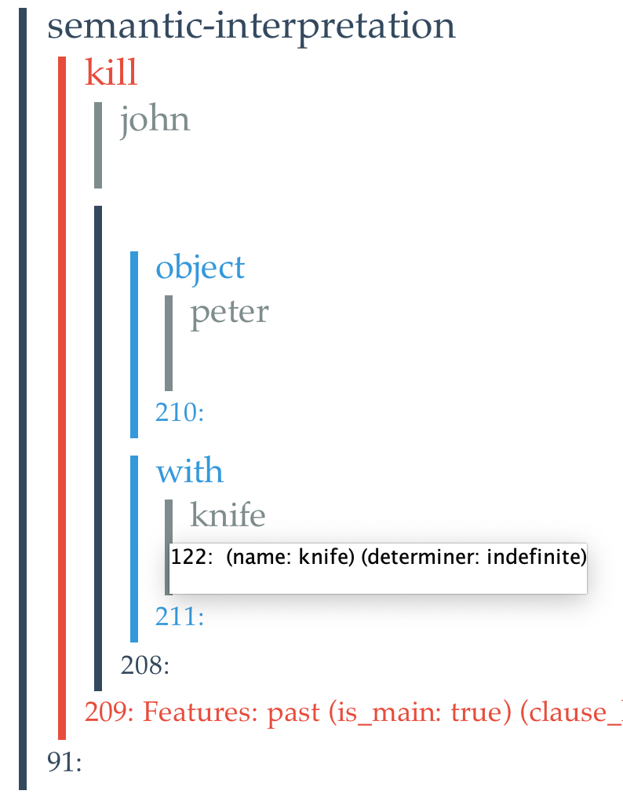

# Welcome to the Genesis Enterprise

This documentation includes technical details of Genesis Story Understanding System for research students and collaborators. You are recommended to follow the documentation pages in sequence to learn how to use the Genesis System for your applications. The development for this site is still in progress, so don't hesitate to [ask Yang](mailto:ztyang@mit.edu) if you have any questions.

The Genesis group aims to develop a computational account of human story understanding and story telling. Our vision and progress is explained in more detail in [The Genesis Manifesto](https://dspace.mit.edu/bitstream/handle/1721.1/119651/CMHI-Report-1.pdf?sequence=1&isAllowed=y).

Genesis reads short stories expressed in English, then it answers questions, interprets with controllable allegiances and cultural biases, notes personality traits, anticipates trouble, measures conceptual similarity, aligns stories, reasons analogically, etc. For an overview of Genesis's story understanding and story telling capacities, see [Genesis research summary](https://groups.csail.mit.edu/genesis/research.html).

The stories Genesis reads include summaries of plays, fairy tales, international conflicts, Native American creation myths. It also reads recipes and How-To books to learn procedural knowledge. The stories are processed by MIT InfoLab's START parser to create triples then translated into Genesis inner language -- a frame-based representation called [Innerese](innerese.md).

English  |  START Parse |  Innerese
--|---|--
John killed Peter with a knife  | [john kill+1 peter] [kill+1 with+1 knife+15830] [john has_number singular] [john is_proper yes] [john has_det null] [peter has_number singular] [peter is_proper yes] [peter has_det null] [knife+15830 has_number singular] [knife+15830 has_det indefinite] [with+1 has_position trailing] [kill+1 has_person 3] [kill+1 has_tense past] [kill+1 is_main yes]  |  

>

The Genesis enterprise was lead by [Patrick Henry Winston](https://people.csail.mit.edu/phw/) (1943 – 2019), former director of the MIT Artificial Intelligence Laboratory and Ford Professor of Artificial Intelligence and Computer Science Laboratory at MIT. We students [celebrate his life](https://www.memoriesofpatrickwinston.com/) and will carry on the Genesis vision. Why now? Patrick described it beautifully in one of his blog post:

> Copernicus taught us about the solar system. Darwin did the same for evolution. Then, Watson and Crick determined the structure of DNA. Collectively they answered fundamental questions about who we are. Now, we can realistically dream of another scientific achievement of equal importance: constructing a top-to-bottom, computational account of our own intelligence.
>
> My students and I want to do it now because we are curious, because the problems are hard, because the problems are exciting, and because we need a better understanding of ourselves and each other and the forces that make us what we are.
>
> We need to do it now because the scientific answers will revolutionize the engineering of intelligent systems. Applications with humanlike intelligence will emerge and empower in education, health care, policy development, business, energy, the environment, cybersecurity, and all the other high-impact areas with unsolvable problems that we must solve.
>
> We can to do it now because we are asking better questions; because computer power is now effectively unlimited; because of encouraging progress in the contributing fields; because of maturing techniques for studying the neural substrate; and because there is immense student interest.
>
> Our better questions include: How are we different from other species? And what are the competences we share with other species such that the difference matters.
>
> Our answer is that we do, in fact, have a differentiating, keystone competence: we build complex, highly nested symbolic descriptions of situations and events. Together with the competences we share with other species, the keystone competence enables story telling, story understanding, and story composition, and all that enables much, perhaps most, perhaps all of education.
>
> We may be wasting our time, of course, but the potential reward is that 1,000 years from now, everyone could say that we first understood our own intelligence.
