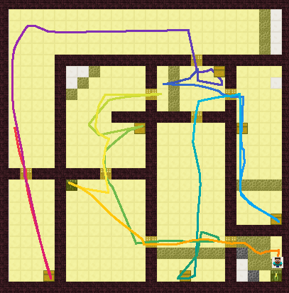

# Dataset I - Human trajectory

The human trajectories and screen recordings are collected during 21 to 24 April. It contains 65 trajectories from 14 players and 51 [video recordings](https://www.dropbox.com/sh/7x8ead9anakvsqj/AAAXNtvJUX-nRbLwhDVTCjbxa?dl=0).

Each player was given five mazes with varying time limit based on their Minecraft expertise (to ensure that they feel time pressure and make strategic decisions). The time limit ranges from 105-240 seconds and is on average 150 seconds. The players found 2-8 of the 8 victims in each maze and found on average 5.6 victims.

The experiment design and analysis can be found [here](https://docs.google.com/presentation/d/1B0QpVHhIzCS9TTBK2Zx0is_RO2cJgxnxIxmmc64cX3M/edit#slide=id.g7f9ee2683c_0_82). The instructions presented to the players can be found [here](https://docs.google.com/presentation/d/1B0QpVHhIzCS9TTBK2Zx0is_RO2cJgxnxIxmmc64cX3M/edit#slide=id.g73957fb8bb_1_146)

## Data format

Download the zipped trajectory data files from [Dropbox link](https://www.dropbox.com/s/xr5gu7ovmhr3dt2/Pilot%202%20trajectories%20-%20txt.zip?dl=0) and unzip the folder in `gridworld/recordingsMalmo/`, you will see a folder structure like this:

```
gridworld/
  recordingsMalmo/
    Recoring replay.ipynb   ## codes for selecting and cleaning data
    originals/              ## the original data collected in April
      player1 ***/
        test3/
          observations.txt  ## the sequence of data, 20 entries per second
          missionInit.xml   ## the mission initialization file
        test4/
        ...
      player2 ***/
      ...
    player21/     ## (ignore this) new data collected using the Stata Maze
```

Inside the test folders, the original data files `observations.txt` collected from Malmo contain sequences of stats like the following:

```
20200417T204005.847011 {
  "Name":"Cristina","Score":0,"XP":0,"Food":20,
  "Life":20.0,"Air":300,"DamageTaken":0,"DamageDealt":0,
  "IsAlive":true,"TimeAlive":26,"WorldTime":1,"TotalTime":31,
  "DistanceTravelled":0,"MobsKilled":0,"PlayersKilled":0,
  "XPos":0.5,"YPos":227.4215999984741,"ZPos":10.5,"cell":"(1,11)",
  "Pitch":0.0,"Yaw":0.0,
  "LineOfSight":{
    "hitType":"block","type":"iron_block",
    "x":0.49999999999999983,"y":229.12000000476837,"z":12.0,
    "inRange":true,"distance":1.5
  },
  "Hotbar_0_size":0,"Hotbar_0_item":"air","Hotbar_1_size":0,"Hotbar_1_item":"air","Hotbar_2_size":0,"Hotbar_2_item":"air","Hotbar_3_size":0,"Hotbar_3_item":"air","Hotbar_4_size":0,"Hotbar_4_item":"air","Hotbar_5_size":0,"Hotbar_5_item":"air","Hotbar_6_size":0,"Hotbar_6_item":"air","Hotbar_7_size":0,"Hotbar_7_item":"air","Hotbar_8_size":0,"Hotbar_8_item":"air",
  "nearby":["iron_block","iron_block","iron_block","iron_block","iron_block","iron_block","iron_block","iron_block","iron_block"]
}
```

Using `gridworld/recordingsMalmo/Recoring replay.ipynb` to select data terms and entries, we generate json files as input to our framework and store them in `gridworld/trajetctories/24by24/`. An example `_player1 ciaran_test3.json` looks like the following:

```
{
    "map": "test3.csv",
    "time_start": "T20224", "time_finish": "T20253", "duration": 179,
    "steps": {
        "0": {
            "time": "T20224",
            "x": 0.9363693372703299, "y": 227.0, "z": 11.446659656203945,
            "yaw": -24.749998, "cell": "(1,12)",
            "lineOfSight": {
                "hitType": "block", "type": "iron_block",
                "x": 2.1135941049334743,"y": 227.85087919425717,"z": 14.0,
                "inRange": true, "distance": 2.9149532318115234
            }
        },
        "1": {
            ...
        },
        ...
    }
}
```

## Experiment replay

Using `gridworld/visualize.py`, we visualize the trajectories in color and generate the png files into `gridworld/recordings/200429 Replay trace/`



## Experiment logistics

To conduct remote game sessions, we sent the following instructions to the participants after arranging the time with them:

> Great! The only thing that we need to do beforehand is To enable remote game control, please register for an Parsec account https://parsecgaming.com/signup/
>
> Download the Parsec desktop app to enjoy smoother connection https://parsecgaming.com/downloads/
>
> After you have created a parsec account and confirmed your email address, please send me your username shown on the top right of your account "app" page with a number string, which looks like ztyang#826739
>
> Whenever we do the game, we can use this Zoom meeting room for communication https://mit.zoom.us/j/8514113919
>
> Look forward to seeing you then!
