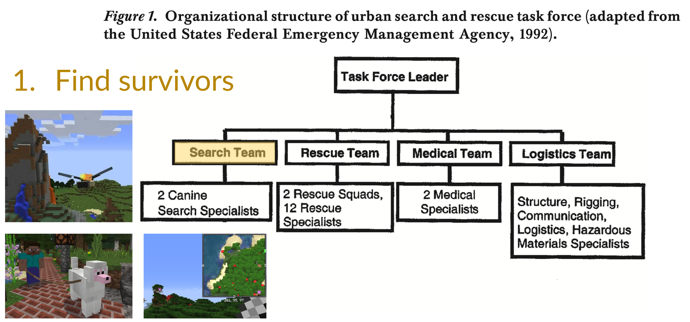
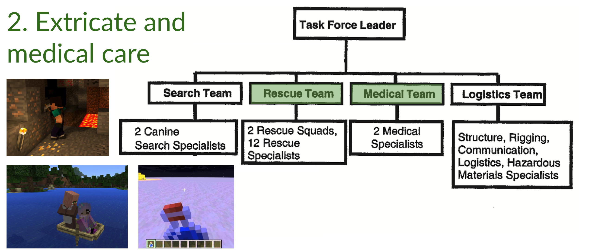
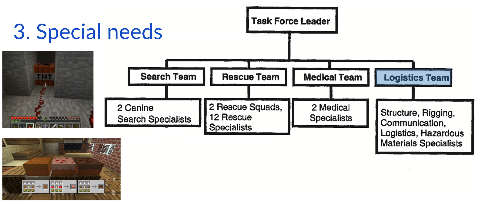
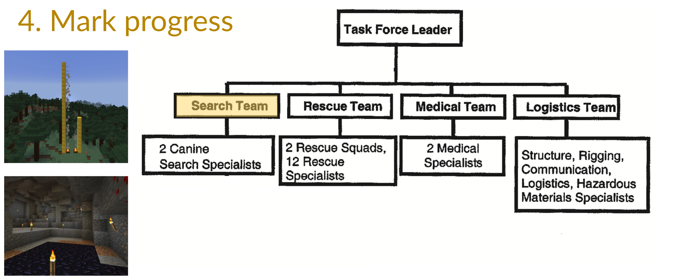

# Search and Rescue (SAR) missions

> I didn't really understand how essential teamwork is to SAR until I played a Minecraft team survival game. Lost in abandoned Mineshafts, killed around spawn points, forever lack of food supplies ... thinking about how a team coacher might advise me has made me a better team player.
>                                                     -- Yang

## Real-world SAR missions

SAR: Search for and provision of aid to people who are in distress or imminent danger. Real-world SAR tasks usually include the following features:

* Collapsed environment in urban SAR
* Natural environment in ground, mountain, cave, and maritime SAR
* Perceptually disorienting
* Physically and cognitively fatiguing
* Operations of hazard materials or weapons of mass destruction

SAR team and procedure usually consists of:

Further readings:

* Jennifer L. Burke, Robin R. Murphy, Michael D. Coovert, and Dawn L. Riddle, [Moonlight in Miami: A Field Study of Human–Robot Interaction in the Context of an Urban Search and Rescue Disaster Response Training Exercise](http://citeseerx.ist.psu.edu/viewdoc/download?doi=10.1.1.64.488&rep=rep1&type=pdf), 2004
* Yuening Zhang, [slides on USAR practice](https://docs.google.com/presentation/d/1V3ySrvFHqwOeno6BNIWO6JPsAxDY4unWW9zwPLTstS8/edit?usp=sharing)
