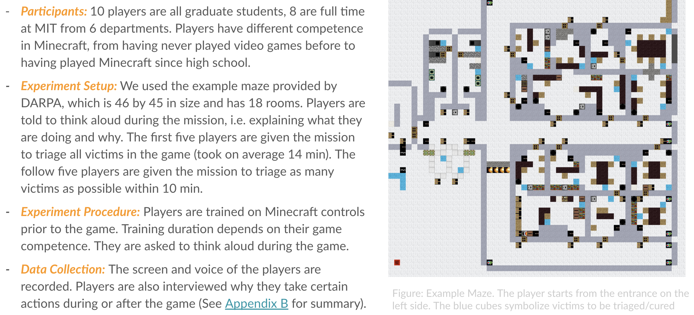
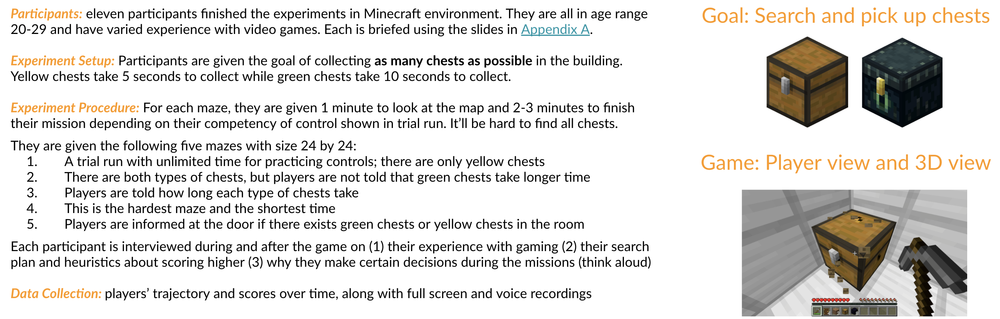
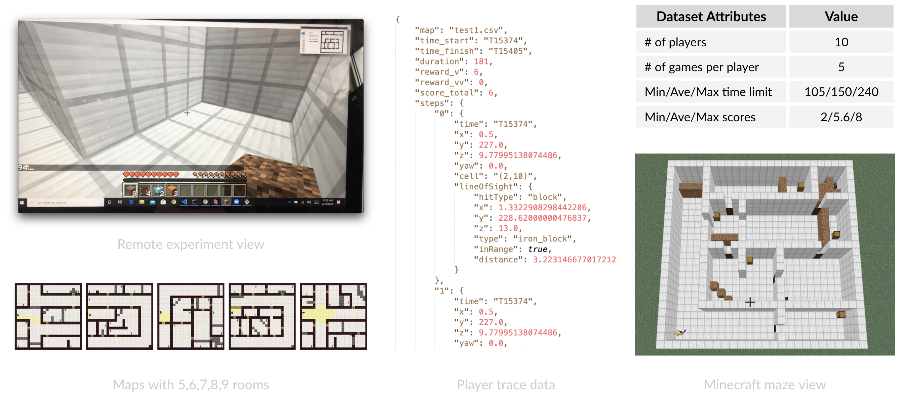
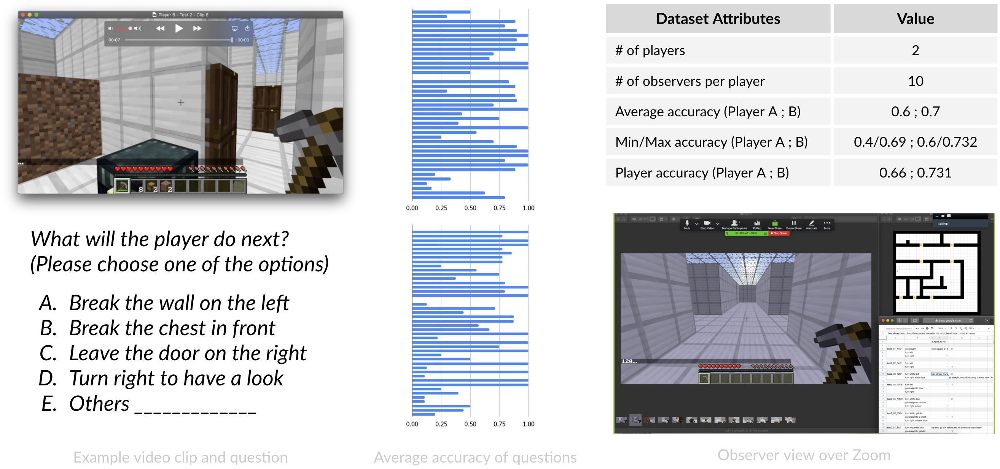

# Human behavior in Minecraft SAR missions

In week 2 and 3, we will focus on understanding human behavior. Note that we have a different plan for Anna/Isabelle and for Christian/Darren in Week 2.

For Anna and Isabelle, you will focus on watching videos from both Pilot test 1 and Pilot test 2.

For Christian and Darren, you will focus on watching videos from ONLY Pilot test 1, until you have finished participating in ASU Pilot test. That's because the experiment design of our Pilot test 2 may spoil your ASU Pilot experience.

In week 3, we will move onto Pilot test 2 and 3.

---

## Pilot test 1: Maze of size 45 by 46, player

In Pilot test 1, we want to see how human players behave in a SAR mission given two different goals: (1) triage all victims in the maze, (2) maximize the number of victims triaged within 10 minutes. Victims with different colors take different amount of time. From blue, green, yellow, orange, to red, they take 2, 4, 6, 8, and 10 seconds. Players are allowed to turn on lights, clear blockage, and put out fire.

Resources for your analysis:

* Videos of 10 players searching the maze while thinking aloud: [Dropbox link](https://www.dropbox.com/sh/1vm2bme978v7u13/AADt4JNTUVXxiLN_xyFrbYT3a?dl=0)
* Minecraft world file - Singleplayer: [Dropbox link](https://www.dropbox.com/sh/e0geq503o2amshk/AACJAy_Sb5u3qq-4oXX6aGToa?dl=0)

Please only look at the following example analysis after you've generated your own theories and made your own summaries:

* Example analysis of player 1-5 behavior: [Google slides](https://docs.google.com/presentation/d/1L9MgpIDIkbv2uAN3bYvPFNBOHeWu2_MUcBuj0-HbOaM/edit#slide=id.g6d2c158114_0_326)
* Example analysis of player 6-10 behavior: [Google slides](https://docs.google.com/presentation/d/1L9MgpIDIkbv2uAN3bYvPFNBOHeWu2_MUcBuj0-HbOaM/edit#slide=id.g6d2c158114_0_354)
* Example lessons learned from player 1-10 behavior: [Google slides](https://docs.google.com/presentation/d/1L9MgpIDIkbv2uAN3bYvPFNBOHeWu2_MUcBuj0-HbOaM/edit#slide=id.g6d2c158114_0_287)

---

### Pilot test 2: Maze of size 24 by 24, player

For Christian and Darren, please stop reading further until have finished participating in ASU Pilot test. The experiment design of our Pilot test 2 may spoil your ASU Pilot experience.

In Pilot test 2, we want to see how human players behave in SAR missions that have tight time constraints and different initial training conditions. The time limit of each player depends on his game expertise and ranges from 2-3 min. Each player will go through all three training conditions as described below:

Resources for your analysis:

* Videos of 14 players searching five mazes of size 24 by 24: [Dropbox link](https://www.dropbox.com/sh/7x8ead9anakvsqj/AAAXNtvJUX-nRbLwhDVTCjbxa?dl=0)
* Maps of the five test mazes: [Dropbox link](https://www.dropbox.com/sh/ccw2yx5iee8fm4l/AADbSXfafBHktU4KF8NpRlOta?dl=0) (includes both the wall-only version presented to the players for planning beforehand and the actual maps)
* Summary of player time limit, game competency, and scores: [Google slides](https://docs.google.com/presentation/d/1B0QpVHhIzCS9TTBK2Zx0is_RO2cJgxnxIxmmc64cX3M/edit#slide=id.g74a80aa3b7_1_0)
* Summary of player reported strategies and preferences: [Google slides](https://docs.google.com/presentation/d/1B0QpVHhIzCS9TTBK2Zx0is_RO2cJgxnxIxmmc64cX3M/edit#slide=id.g73957fb8bb_1_79)
* Download human trajectory dataset (visualized traces on maps): [Dropbox link (2.28 MB)](https://www.dropbox.com/s/tgoas12z2t50rio/Pilot%202%20trajectories%20-%20png.zip?dl=0)
* Description of the human trajectory dataset: [Dataset I - Human trajectory](data-trajectory.md)

Please only look at the following example analysis after you've generated your own theories and made your own summaries:

* Analysis of player behaviors: [Google slides](https://docs.google.com/presentation/d/1B0QpVHhIzCS9TTBK2Zx0is_RO2cJgxnxIxmmc64cX3M/edit#slide=id.g74a80aa3b7_1_97)
* Categorization of player behaviors: [Google slides](https://docs.google.com/presentation/d/1RXMbrn1qvFAdB7Xm-xXjeHYyLpsaFo-nNeTyMh-uCUk/edit#slide=id.g772d6496c2_0_811)

---

### Pilot test 3: Maze of size 24 by 24, observer

In Pilot test 3, we want to see how good are humans in predicting actions?

* Video clips of 2 players searching three mazes of size 24 by 24: [Player 6](https://www.dropbox.com/sh/7x8ead9anakvsqj/AAAXNtvJUX-nRbLwhDVTCjbxa?dl=0), [Player 10]([Player 6](https://www.dropbox.com/sh/7x8ead9anakvsqj/AAAXNtvJUX-nRbLwhDVTCjbxa?dl=0)),
* Raw data of prediction questions, answers, and commentary: [Google sheet](https://docs.google.com/spreadsheets/d/1rT4H0OONnfuTJHy88t7uk_XbUpz87oeR79LFQmvTIQg/edit?usp=sharing)
* Analysis of observer predictions: [Google slides](https://docs.google.com/presentation/d/1RXMbrn1qvFAdB7Xm-xXjeHYyLpsaFo-nNeTyMh-uCUk/edit#slide=id.g772d6496c2_0_335)

<!---
### Pilot test 4: Maze of size 50 by 90, player

It's a 10-minute game with 3 minutes to plan with the map (in the below Dropbox link)

* Minecraft world file - DARPA Pilot: [Dropbox link](https://www.dropbox.com/sh/e0geq503o2amshk/AACJAy_Sb5u3qq-4oXX6aGToa?dl=0)
* Pilot study [questionaires](https://asu.co1.qualtrics.com/jfe/form/SV_0Mm2h0drxwLCI73) designed by Arizona State University
--->
