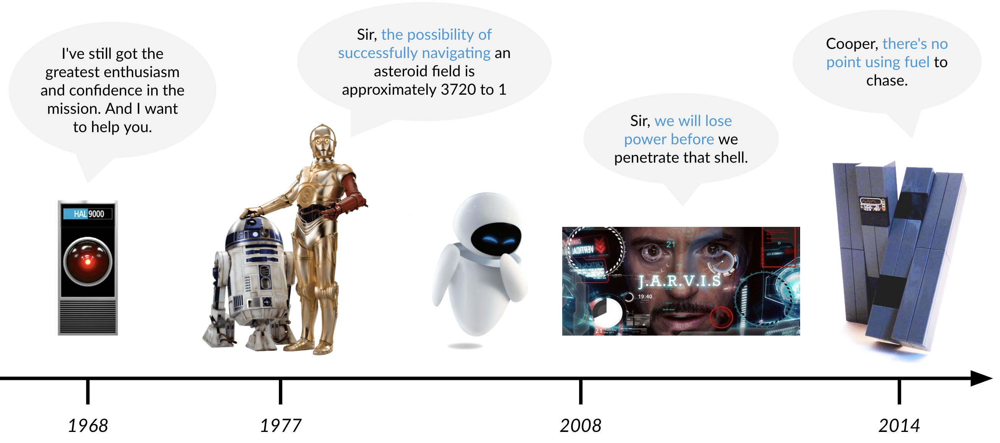
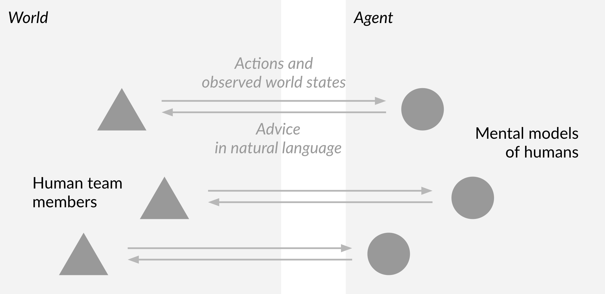
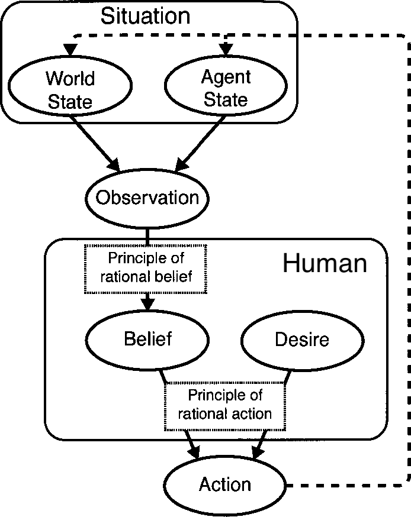
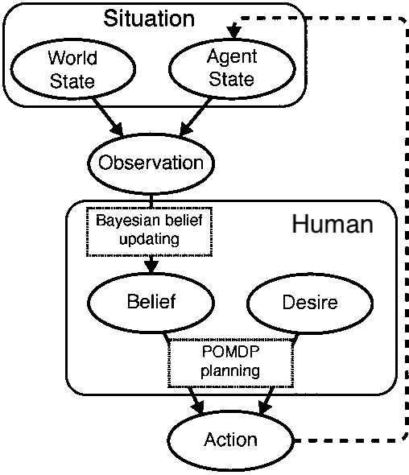
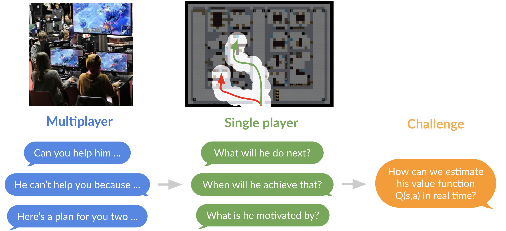

# Vision - Team coacher agents

To develop socially intelligent team assistants, we need to enable them to infer humans’ strategies, beliefs, and future actions. This page includes the behavior that we wish our agents can demonstrate.

## Agents that have Theory of Mind

Theory of mind is the ability to attribute mental states — beliefs, intentions, desires, emotions, knowledge, etc. — to oneself and to others.

> Tom opened a door. He found the way in was blocked by debris. He started clearing the debris.
>
> Agent: (Belief) Tom believed that there may be victims in the room.
>
> Agent: (Intention) Tom may wish to break through the debris.
>
> Agent: (Desire) Tom wants to follow his original search plan (because he didn't just turn away).
>
> Agent: (Emotion) Tom may feel stressful under time pressure and increasing workload.
>
> Agent: (Knowledge) Tom knows how to clear debris.

## Agents that have Bayesian theory of mind

The following graph may help us understand the inference and prediction process. Given the actions of one player, we want to infer his belief update model and POMDP planning model, then we can make predictions about future actions.

Psychological theory |  Computational implementation
:-------------------------:|:-------------------------:
  |  

>

Further readings:

1. Baker, Chris, Rebecca Saxe, and Joshua Tenenbaum. ["Bayesian theory of mind: Modeling joint belief-desire attribution."](http://aiweb.cs.washington.edu/research/projects/aiweb/media/papers/cogsci2011.pdf), 2011.

2. Baker, Chris, Rebecca Saxe, and Joshua Tenenbaum. ["Goal inference as inverse planning."](http://csjarchive.cogsci.rpi.edu/proceedings/2007/docs/p779.pdf), 2007.

## Agents that coach individuals based on their planning model

Potential ways for agents to improve singleplayer's taskwork by triggering them to think about their playing style:

> Agent: You seem to believe that you have searched every room on the west wing. Are you sure about that?
>
> Agent: You seem to have no prioritization of which rooms to search first. Do you have a preference?
> 
> Agent: You seem to be fixated on your original plan. Do you have a strong reason to do that?

## Agents that coach teams with natural language

Potential ways for agents to improve teamwork using Theory of Mind:

* Request for help on behalf of a human team member based on the mental states of the other team members

> Agent: I think you are capable of helping him because you have the knowledge of clearing debris and I predict that you will have spare time after finishing your tasks.

* Explain a human team member's actions in terms of his mental states

> Agent: He can't come help you in the next 5 minutes because he is seems to have the intention of searching the west wing.

## Agents that learn lessons from stories

Stories include the histories of the human team members, the reports from past missions, and the experience from previous coaching. Stories help us think on higher levels and longer terms, find patterns, and encode knowledge.

Stories can be generated by the agent based on the inference made and actions observed during a mission. They can be also collected from individual human team members after the mission. With stories, agents may make the following reasoning:

> Agent: Based on the previous 20 missions, humans tend to act less and less rationally after 3 minutes.
>
> Agent: Based on this member's previous 3 missions, he tends to act very greedily in the last minute.
>
> Agent: Based on my previous interactions with this team, I tend to improve the teamwork more if I give instructions instead of ask questions.
