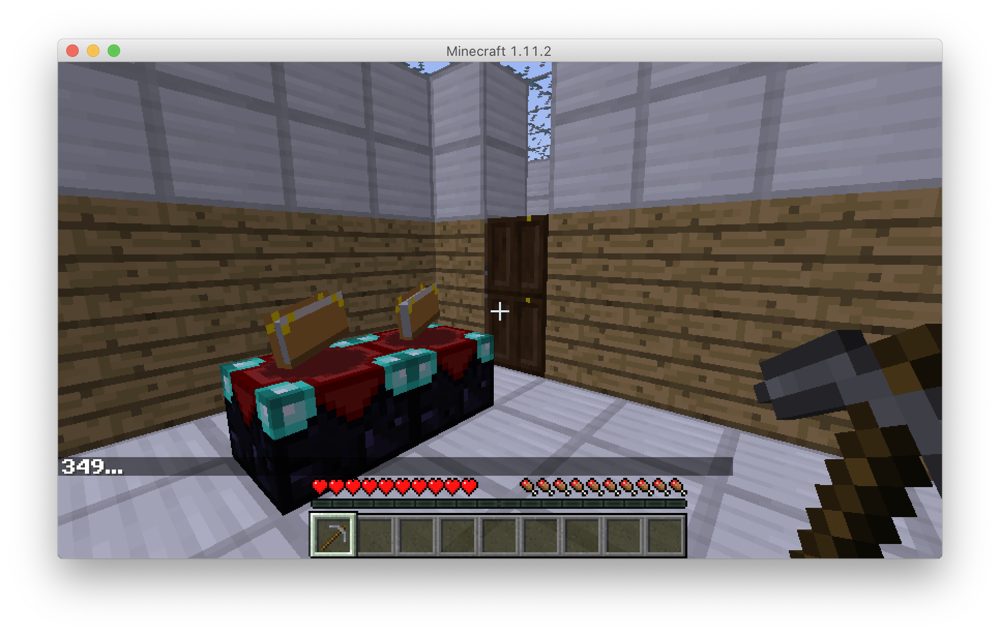

# Set up Malmo

Malmo is the platform we use for controlling agents in Minecraft and collecting data of Minecraft players.

Follow the [instructions](https://github.com/microsoft/malmo) to download the prebuilt version of Malmo, install the dependencies, and configure your JAVA_HOME environment variable. You can install Malmo at the same working directory as the tom-minecraft repository.

### Configure JAVA_HOME environment variable

To set JAVA_HOME on MacOS, follow the [instructions](http://www.sajeconsultants.com/how-to-set-java_home-on-mac-os-x/?utm_source=rss&utm_medium=rss&utm_campaign=how-to-set-java_home-on-mac-os-x).

To set JAVA_HOME on Windows, press Windows key and search for "Environmental Variables" > New > Choose folder where you downloaded `C:\\Program Files\Java\jdk1.8.0_251`

When you check your Java version on terminal, it should show that you have JDK 1.8.0_*** depending on the Java SE you installed on Oracle site:

```
(On MacOS)
$ java -version
openjdk version "1.8.0_222"
OpenJDK Runtime Environment (AdoptOpenJDK)(build 1.8.0_222-b10)
OpenJDK 64-Bit Server VM (AdoptOpenJDK)(build 25.222-b10, mixed mode)
```

### Test run Malmo environment

We are going to run an example maze that looks like our Stata center first floor. You need to have two terminal panels open.

At one panel, launch Malmo client.
```
(On MacOS)
$ cd /YOUR_WORKING_DIRECTORY/Malmo/Minecraft
$ ./launchClient.sh

(On Windows)
$ cd \YOUR_WORKING_DIRECTORY\Malmo\Minecraft
$ launchClient
```

It might take you a minute when launching it for the first time. When you see the terminal showing `> Building 95% > :runClient` and a "Minecraft 1.11.2" window showing up, you are successful. Otherwise, check if your JAVA_HOME environment has been set properly

At another panel, run our code for initiating a Minecraft world based on a csv file that specifies the map.

```
(On MacOS)
$ cd /YOUR_WORKING_DIRECTORY/tom-minecraft/gridworld
$ python malmo.py
```

You should see the following world being loaded in your "Minecraft 1.11.2" window:

<<<<<<< HEAD

=======


### For MacOS

`cd Malmo/Minecraft` and run `./launchClient`
>>>>>>> 7f4c4a3769bce8f618b6b613db82e6d8ce10ed60

<!---
## Set up World builder

```
pip install nbtlib
python setup.py install
```
--->
