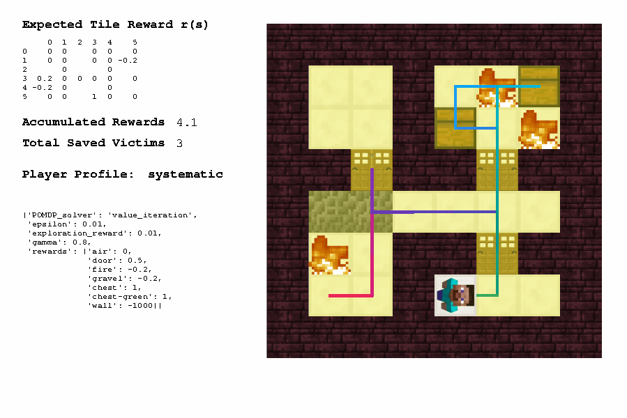

# Set up the gridworld

Folder `tom-minecraft/gridworld/` includes most of the codes we use for inferring player planning model and predicting player actions through planning. It simplifies the Minecraft environment as a 2D gridworld, assuming that there will only be one object that the player interact with along the vertical axis.

## Install Python dependencies

First, you might need to [install miniconda](https://docs.conda.io/projects/conda/en/latest/user-guide/install/index.html) for setting up a Python virtual environment for this project.

At terminal, create a python 3.7 virtual environment and activate it when testing codes
```
(base) $ conda create --name mine python=3.7
(base) $ conda activate mine
(mine) $
```
Use `conda deactivate` for exiting from the environment.

## Install required libraries
```
(mine) $ conda install matplotlib imageio jupyter pandas numpy scipy Pillow tqdm networkx moviepy future opencv
(mine) $ conda install pytorch torchvision cpuonly -c pytorch
(mine) $ pip install nbtlib mkdocs
```

Refer to `/gridworld/tutorials/` for some Jupyter Notebook examples of using numpy, matplotlib, and json libraries.

## Install commandline tools

We use ImageMagick for saving PNG files with clear text (converting from EPS format that's generated by Python Turtle). You may install it using [Homebrew](https://brew.sh/) or [MacPorts](https://macports.org/). 

``````
brew install imagemagick
``````

- 

<!---

## Set up your output folders

When you run the test cases, some screenshots, log files, and plot images may be generated to help you present the results of your computational experiments. We don't want those files to be shared

Those output folders have been put in `.gitignore` and will not be shared among the team.

Before you run the test cases for the first time, please create a folder named `'gridworld/recordings/_test cases/'`. That's where screenshots of your test runs will be located.

gridworld/plots/
--->

## Run a test case

Go to `gridworld` folder and run `visualize.py`, you should see the following Python Turtle window show up.

If you are using macOS 10.6 or later, your mac may lead you to the computer's log in page once you run the command. Solutions can be found [here](https://stackoverflow.com/questions/57400301/how-to-fix-tkinter-every-code-with-gui-crashes-mac-os-with-respring). (For me, downgrading to python 3.7.0 fixes the problem).

```
(mine) $ cd /YOUR_PATH_TO/tom-minecraft/gridworld
(mine) $ python visualize.py
```



Try out more test cases by following [Planning test cases](tut-planning.md).

## Troubleshooting

### tkinter on macOS 10.6

If your python just crashes when you run `visualize.py` and your macOS version is 10.14.6 Mojave, you are experiencing a compatibility issue with your python version. The solutions can be found here. For Anna, downgrading to python from 3.7.7 to 3.7.0 fixed the problem.
