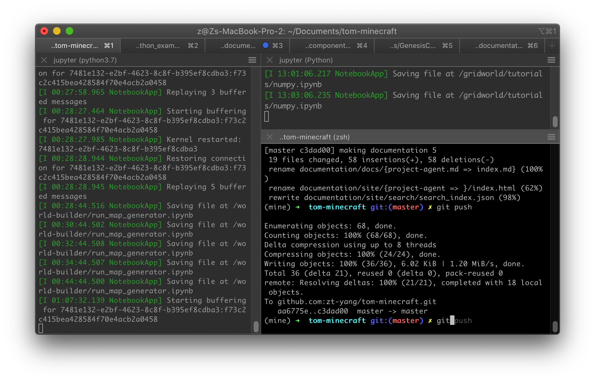

# Set up the repository and documentation

To clone the GenesisCore repository, you need to send [Yang](mailto:ztyang@mit.edu) your GitHub username to be invited as a collaborator.

Open terminal and go to your favorite work directory (e.g., ~/Documents) to clone the project:

```
git clone git@github.com:zt-yang/tom-minecraft.git
```

## (Optional) Install PyCharm IDE for debugging

I use [PyCharm](https://www.jetbrains.com/pycharm/download/#section=mac) for more efficient debugging. It's free to use the Professional version after requesting student license.

## (Optional for MacOS) Install iTerm2 for splitting panels

I use [iTerm2](https://www.iterm2.com/) as a replacement for Terminal because it supports multiple tabs and flexible panels when you right click.



## (Optional for MacOS) Install zsh for tab completion

I use [zsh](https://ohmyz.sh/) for configuring my terminal/iTerm2 app to make my command line experience more efficient. I love its command completion feature, which should be enabled by default.


## Important components of the repository

### First-level folders

```
/gridworld        ## main folder for our project
/world-builder    ## extract 2D map from Minecraft world folder
/documentation    ## run `mkdocs serve` to see the site offline
...
```

### gridworld folder

```
MalmoPython.so    ## Malmo package file for MacOS
MalmoPython.pyd   ## Malmo package file for Windows
```

(under construction)
