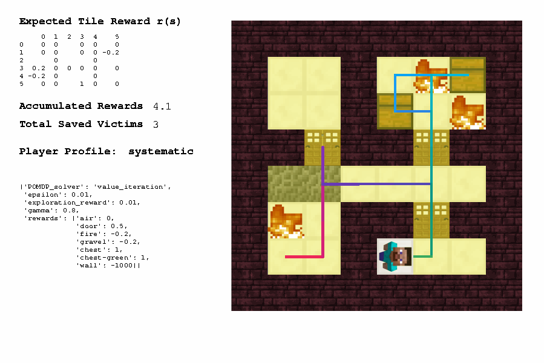

# All test cases

When before pushing changes in the `gridworld/` repository or merging the git changes, we need to make sure that all test cases in `gridworld/visualize.py` can run successfully.

To run the test cases, go to `gridworld/visualize.py`, and uncomment the MODEs between line 30 to line 41 to test different applications of the gridworld codes.

```
MODE = 'PLANNING'   ## normal VI
# MODE = 'HIERARCHICAL_PLANNING'  ## two-level VI
# MODE = 'TILE_LEVEL_DFS'     ## VI-DFS
# MODE = 'ROOM_LEVEL_MCTS'     ## VI-MCTS
# MODE = 'INVERSE_PLANNING'   ## default is two-level VI
# MODE = 'EXPERIMENT_REPLAY'  ## visualize human trajectory, generate PNG, or PNGs, or GIF
# MODE = 'REPLAY_IN_MALMO'  ## visualize in Malmo environment
# MODE = 'REPLAY_DISCRETIZE'  ## generate discretized trajectory file
# MODE = 'EXPERIMENT_PARAM'   ## test how parameters affect planning algorithms
# MODE = 'EXPERIMENT_ALGO'    ## test how different algorithms affect planning performance
# MODE = 'PRINT_MAP'  ## take screenshot of map, random initialize starting location
# MODE = 'LEARNING'   ## for reinforcement learning
```

## 1. Tabular

### 1a. Value iteration (VI)

Run `visualize.py` as it is, you will see:



Change PLAYER_NAME in line 62 from 'systematic' to 'with_dog' and 'fire_fighter'

PLAYER_NAME = with_dog |  PLAYER_NAME = fire_fighter
:-------------------------:|:-------------------------:
  |  

## 2. Hierarchical

### 2a. VI + VI

Comment out line 30 and uncomment line 31 `# MODE = 'HIERARCHICAL_PLANNING'`. Run `visualize.py` and you will see:


### 2b. VI + DFS

Comment out line 31 and uncomment line 32 `# MODE = 'TILE_LEVEL_DFS'`. Run `visualize.py` and you will see:


### 2c. VI + MCTS

Note: Please skip this one for now as I just created a bug that I need to fix.

Comment out line 32 and uncomment line 33 `# MODE = 'ROOM_LEVEL_MCTS'`. Run `visualize.py` and you will see:


## 3. Inverse planning

Comment out line 33 and uncomment line 34 `# MODE = 'INVERSE_PLANNING'`.

Run `visualize.py` with PLAYER_NAME in line 62 equals to 'fire_fighter' and 'with_dog':

PLAYER_NAME = fire_fighter |  PLAYER_NAME = with_dog
:-------------------------:|:-------------------------:
 | 

## 4. Experiment replay

This mode visualizes all of the human trajectories (e.g., `_player10 shaoying_test2.json`) in `gridworld/trajectories/24by24/`:


